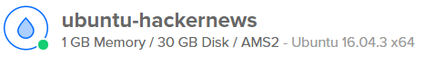

# The Road to Rapid Mongo Queries

In a recent project we used MongoDB to store a very large dataset (millions of entries). But as the number of saved documents increased, we saw a steep decline in the performance of our queries to the database.

This lackluster performance meant that our server often had very slow response time for http requests, and that our frontend often took upwards of 15 seconds just to populate the frontpage.

Through the use of indices in our database we managed to decrease the average response time for the server from 15358 ms to 48 ms - that’s more than 300 times faster!!

Everyone who handles large numbers of documents in MongoDB and isn't already using indices will benefit by introducing them in their collections.

## Description of the Database

In the recent school project, we have set up a simple REST API to handle a HackerNews clone site. For this basic site our teacher would automatically post posts to our API over the projects time period. This ended up with us having millions on posts stored in our database, since we were getting new posts all the time over several weeks. As of right now we have over 5 million posts:

The backend for our web application is a Node.js instance running an Express server with mongoose to model our data to a Mongo database. Each post has several fields most related to the post itself, but some also relating the post to users and other posts.

Our web application is hosted on digitalocean on a very limited server. The server has 1GB of RAM, and 30GB of disk space, and 1 CPU core.

## Indices, What are They?

Our backend ended up creating some issues. As the post counts started getting into the millions the response time of our backend had gotten excruciatingly slow. No person would want for any web service they use, to take upwards of 15 seconds per request. We had to fix this issue both for our sake and our users. Indices was our solution.

*“Indices are special data structures that store a small portion of the collection’s data set in an easy to traverse form. The index stores the value of a specific field or set of fields, ordered by the value of the field”[^footnote]: 1, [Link](https://docs.mongodb.com/v3.4/indexes/)..*
__-MongoDB documentation__

What this does is allow our database to search through far less data every time a request is made. This small but significant change in our database structure reduced the response time all the way down to 50ms in some cases.

Why did we need indices though?  We chose to use MongoDB for our database which is a noSQL database. An SQL database has a lot more structure built into its system already, thus as the data load increases the response time doesn’t necessarily do the same. With MongoDB on the other hand, it performs a collection scan, scanning through every element in the collection. This scan is obviously extremely fast so with small amounts of data the response time isn’t gonna be affected enough to decrease the user experience, but that isn’t the case for us. We have several million pieces of data for our database to go through, and for every request the database would have to search through all of these. It makes sense that even machines have a limit as to how fast they work, and therefore by adding indices to our data structure, we limit the amount of data which we have to scan through.

## Indices in Practice
To introduce indices to your own collections is easy! The first thing you do is to connect to your instance of MongoDB using the Mongo Shell.

You can either use a local instance of the mongo shell (HINT! If Mongo is in your path you can just write mongo to start the shell). 

Or you can download a docker image including all the bells and whistles from DockerHub.
If you use the image you have to start the mongo shell like this.

Format: ![mongodb is the name of the container and mongo is the
name of the application we want to execute.]

When you’re finally connected to you MongoDB instance you’ll have to navigate to the database where your collections reside and actually create the indices.

__db.collectionName.createIndex({ field : order })__

Format: ![posts is the name of the collection, post_parent is the field and the -1 
ensures that the index is created in an descending order]

If the command is successful the Mongo shell will present you with something like the output you see in the above image, except with values according to your system. 
 
For indices to perform at their best the data structures that are created have to be stored in memory. This makes it easy for mongo to traverse the documents when you query the collection. Incase the size of your index exceeds the available memory, MongoDB will save the index on the disc which is slower by quite a margin. 

To ensure that your indices remain a tolerable size, you can always use the mongo shell command.
__db.collectionName.totalIndexSize( )__

Format: ![The result you see, is the number of bytes taken by 
the indices in the posts collection.]

The result you see, is the number of bytes taken by 
the indices in the posts collection.

If you installed the docker image mentioned above, you can skip a lot of hoops by running the following command in a shell.
__~$ docker stats --no-stream__

Format: 

docker stats list the memory usage in an easy to digest fashion, without the need for 
strenuous conversion between bytes and megabytes.

## What We Can Learn From This

Using a MongoDB one must be weary of the amount of data that they have to handle. When handling millions of data points, it is imperative to use indices if you do not wish to demolish your users experiences. Indices are not difficult to setup and they allow for a faster performance. Lastly one must also make sure that their server has enough ram to handle large amounts of data especially when indexed.
